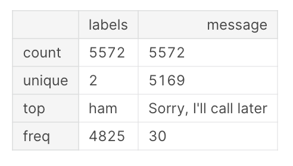
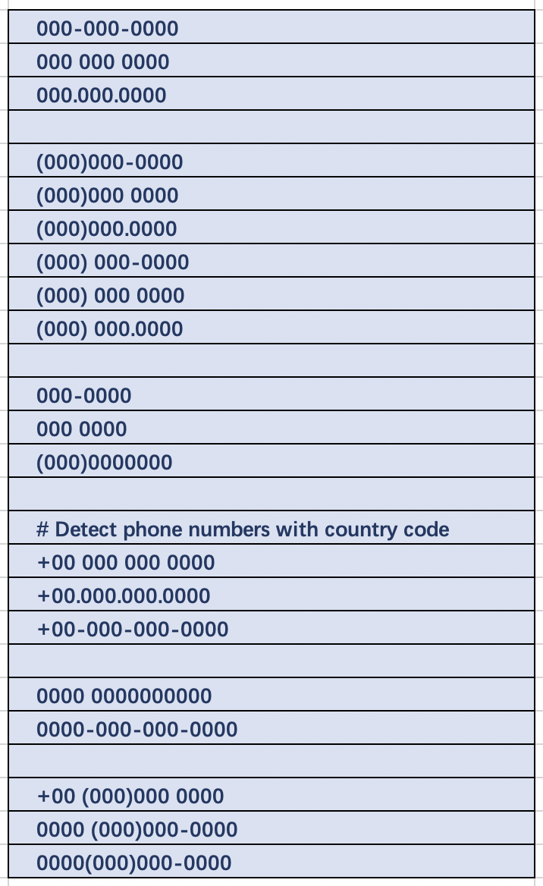
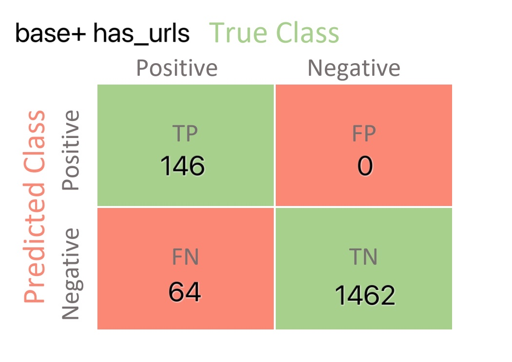
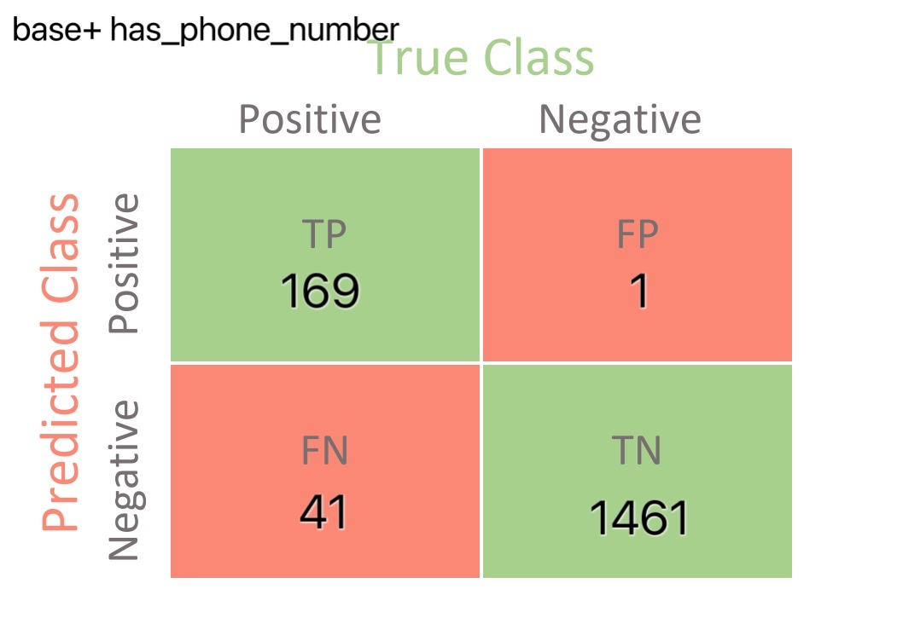
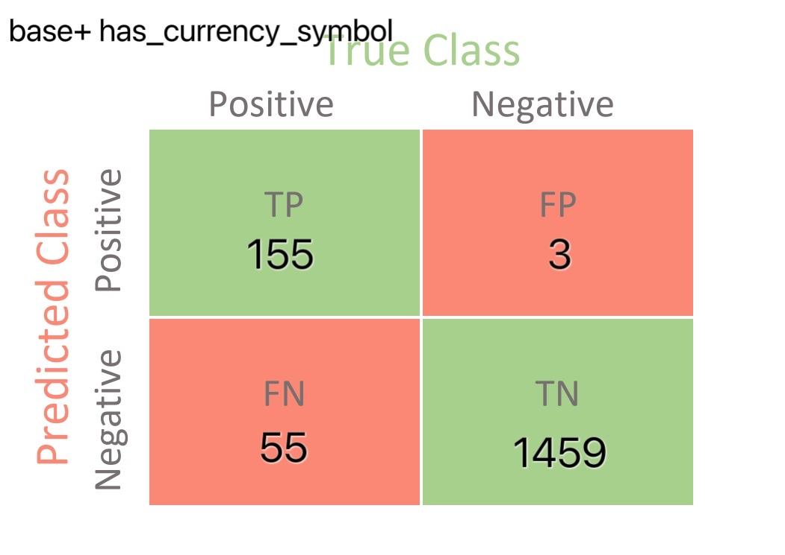
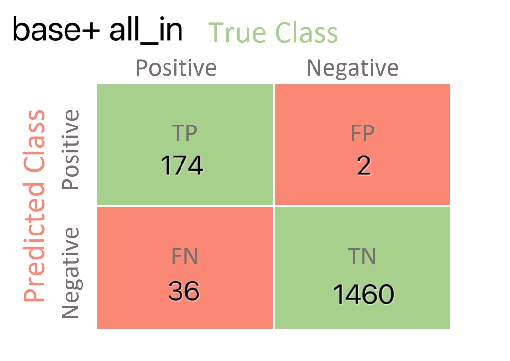

Spam Content Detection and Classification using Naive Bayes Classifier
---------------------------------------------------
## Objective:
The spam content increases as people extensively use social media and the time spent by people using social media is also overgrowing, especially during the time of the pandemic. While users get a lot of text messages through social media they cannot recognize the spam content in these messages. To improve social media security, the detection and control of spam text are essential. Therefore, we want to choose spam content detection as the main topic of this project. Naïve Bayes algorithm will be used for learning and classification of messages as spam and ham. We will use some features to train the models and compare the results.

## Dataset:
* Origin: For the dataset, [MS Spam Collection Data Set](https://archive.ics.uci.edu/ml/datasets/sms+spam+collection) will be used. It is a public set of SMS labeled messages that have been collected for mobile phone spam research. 
* Describe the dataset: 
  * It consists of 5574 instances. 
    * A collection of 425 SMS spam messages was manually extracted from the Grumbletext Web site. 
    * A subset of 3375 SMS randomly chosen ham messages of the NUS SMS Corpus (NSC). 
    * A list of 450 SMS ham messages collected from Caroline Tag’s PhD Thesis. 
    * Finally, 1,002 SMS ham messages and 322 spam messages were collected from the SMS Spam Corpus v.0.1 Big. 
* For attribute information, the dataset is composed of just one text file, where each line has the correct class followed by the raw message.

## Exploratory Data Analysis

* There are just two labels: ham and spam.
* From all 5572 messages, there are 5169 unique messages.
* The number of ham messages is 4825.
* The most frequent message is "Sorry, I'll call later", which shows 30 times.

We make a bar chart to detect how long the text messages are. Almost all the messages are below 200 characters.

## Feature Selection
The features we chose include the base feature, feature_url, feature_num, and feature_currency_symbol.
* Base feature: Tf-idf weight 
* Feature_url: has url or not.
* Feature_num: has phone number or not. 
  * The phone number format include:
  * 
* Feature_currency_symbol: has currency symbol or not.

## Text preprocessing
1) Remove punctuations and stopwords
2) Vectorize the messages and convert them into sparse matrix
3) Train_test split: 70% as training set and 30% as test set

#### For base features:

* Use `TfidfTransformer()` to calculate the Tf-idf weight.

#### For feature_url:

* Write a function _has_url_, which can test whether messages contain urls or not with regular expression `re.match("www.", line)`
* Utilize `preprocessing.LabelBinarizer()` to convert the variable into binary version 
* Transform it into sparse matrix
* Use `scipy.sparse.hstack()` to stack the new feature to the base feature

#### For feature_phoneNumber:

* write a function _has_phoneNumber_, which can test whether messages contain phone number or not with regular expression `re.findall('((?:\+\d{2}[-\.\s]??|\d{4}[-\.\s]??)?(?:\d{3}[-\.\s]??\d{3}[-\.\s]??\d{4}|\(\d{3}\)\s*\d{3}[-\.\s]??\d{4}|\d{3}[-\.\s]??\d{4}))', line)`
* Utilize `preprocessing.LabelBinarizer()` to convert the variable into binary version 
* Transform it into sparse matrix
* Use `scipy.sparse.hstack()` to stack the new feature to the base feature

#### For feature_currency_symbol:
* write a function _has_currency_symbol_, which can test whether messages contain currency symbol or not with regular expression `re.findall("\\$|\\£", line)`
* Utilize `preprocessing.LabelBinarizer()` to convert the variable into binary version 
* Transform it into sparse matrix
* Use `scipy.sparse.hstack()` to stack the new feature to the base feature

Finally, we got five types of features:

| Features      | Description |
|---------------|-------------|
| base features |messages’ tfidf weight             |
| base + has_urls              |  messages’ tfidf weight and has urls or not           |
|base + has_phone_number               | messages’ tfidf weight and has phone number or not            |
|base + has_currency_symbol               | messages’ tfidf weight and has currency symbols or not         |
|   all_in                                      |    all of the features            |

## Model Selection -- Multinomial Naive Bayes
Multinomial Naïve Bayes algorithm will be used for learning and classification of messages as spam and ham. 
Why Multinomial Naive Bayes classifier algorithm is a good choice for spam filtering?

* Bayes theorem has strong independence property and it gives the probability of an event based on the prior knowledge of a related event. 

* Multinomial  Naive Bayes model: a document can be represented by a feature vector with integer elements whose value is the frequency of that word in the document.  The document feature vectors capture the frequency of words, not just their presence or absence. 

Finally, accuracy, precision, recall, F1-score, and support cases (how many cases supported that classification) will be used to evaluate the model performance.

## Results

Comparing the baseline model with the model having the url feature, we can find they have exactly the same value for all metrics, which means whether having url or not doesn’t contribute to distinguishing spam messages from ham ones in this dataset. For the third model with _has_phone_number_ feature, it has 1% more accuracy than baseline and contributes to 10% increase of recall and 7% increase of F1 score. Therefore, phone number can be a key feature to find spams in this case. Though the last feature _has_currency_symbol_ doesn’t perform as well as _has_phone_number_, it still contributes 1%, 4%, and 2% increase in accuracy, recall, and F1 score respectively. Finally, the all-in model has the best performance with 98% accuracy, 99% precision, 83% recall, and 90% F-1 score. To conclude, the model with the combination of all features should be chosen to detect spam messages.

| Model Name | Accuracy | Precision | Recall | F1  |
|-----------|----------|-----------|--------|-----|
| baseline  | 96%      | 100%      | 70%    | 82% |
| base + has_urls      | 96%      | 100%      | 70%    | 82% |
| base + has_phone_number   | 97%      | 99%       | 80%    | 89% |
| base + has_currency_symbol | 97%      | 98%       | 74%    | 84% |
| all_in       | 98%      | 99%       | 83%    | 90% |

  
   
  
  
  

## Command Line

`python spam_detection.py --dataset SMSSpamCollection`

## Discussion

* Are there any other features can be used to detect spams?
* Besides multinomial Naive Bayes model, are there any other models which can be used for spam detection problem?

## Reference
* Kaddoura, S., Chandrasekaran, G., Elena Popescu, D., & Duraisamy, J. H. (2022). A systematic literature review on spam content detection and classification. PeerJ. Computer science, 8, e830.
* Parmar, Nandan & Sharma, Ankita & Jain, Harshita & Kadam, Amol. (2020). Email Spam Detection using Naïve Bayes and Particle Swarm Optimization. Volume 6. 367 - 373.
* Sai Charan Reddy, M. (2021) SMS Spam and Ham Detection Using Naïve Bayes Algorithm. SSRN Electronic Journal, 251 - 256.
* Almeida, T. A., Hidalgo, J. M. G. & Yamakami, A. (2011). Contributions to the study of SMS spam filtering: new collection and results.. In M. R. B. Hardy & F. W. Tompa (eds.), ACM Symposium on Document Engineering (p./pp. 259-262), : ACM. ISBN: 978-1-4503-0863-2